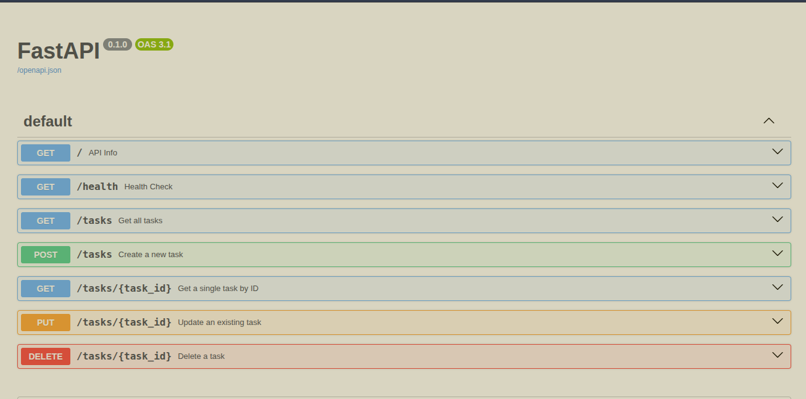
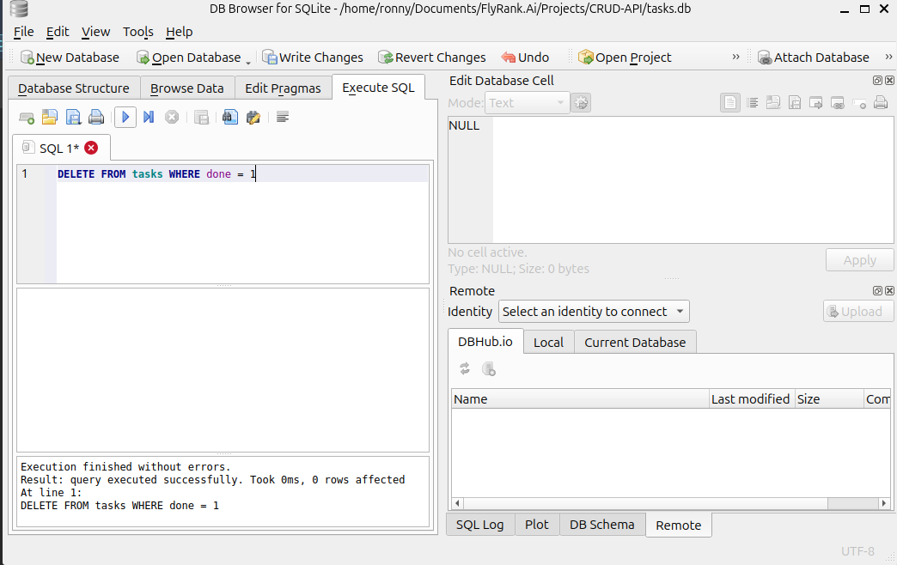

# Task API

A simple CRUD API for managing a to-do list, built with FastAPI. Data is stored in memory (no database) — it resets when the server restarts.

## Tech Stack

- Python 3.10+
- FastAPI
- Uvicorn

## How to Run

1. Clone the repo:
```bash
   git clone https://github.com/LincolnMoki/CRUD-API.git
   cd CRUD-API
```

2. Create and activate a virtual environment:
```bash
   python3 -m venv venv
   source venv/bin/activate   # Windows: venv\Scripts\activate
```

3. Install dependencies:
```bash
   pip install fastapi uvicorn
```

4. Run the server:
```bash
   uvicorn main:app --reload
```

5. Open http://localhost:8000/docs to try it out interactively.

## Endpoints

| Method | Path             | Description               |
|--------|------------------|----------------------------|
| GET    | /                | API info                  |
| GET    | /health          | Health check               |
| GET    | /tasks           | List all tasks             |
| GET    | /tasks/{task_id} | Get a single task          |
| POST   | /tasks           | Create a new task          |
| PUT    | /tasks/{task_id} | Update an existing task    |
| DELETE | /tasks/{task_id} | Delete a task               |

## Example Request

```bash
curl -i -X POST http://localhost:8000/tasks \
  -H "Content-Type: application/json" \
  -d '{"title":"Buy milk"}'
```

Example response:
curl -i http://localhost:8000/health
server: uvicorn
content-length: 15
content-type: application/json

{"status":"ok"}% 

curl -i http://localhost:8000/tasks/1
date: Mon, 20 Jul 2026 08:45:20 GMT
server: uvicorn
content-length: 42
content-type: application/json

{"id":1,"title":"Buy milk","done":"true "}% 
## Swagger UI



## Database

This project stores tasks in a **SQLite** database (`tasks.db`) instead of an in-memory list.

**Why SQLite?**
- It's a single file — no separate database server to install or run.
- Zero setup: opening the file creates it if it doesn't exist.
- Perfect for small projects and learning — the data now survives a server restart.

**Where it lives:**
The database file `tasks.db` is created automatically the first time you run the app. It's git-ignored, so each fresh clone starts with a clean database, reseeded with the 3 example tasks.

**Run it:**
```bash
uvicorn main:app --reload
```
No extra setup — `tasks.db` and the `tasks` table are created automatically on first run.

**Example SQL query (run by hand in DB Browser):**
```sql
SELECT * FROM tasks WHERE done = 1;
```
This returned only the completed tasks — the same data `GET /tasks?done=true` returns through the API, since both read from the same file.

**Screenshot:**
